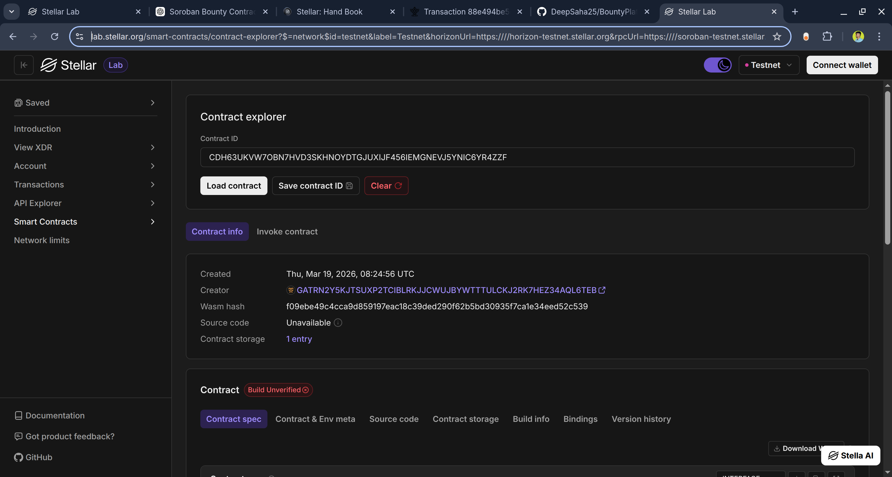

# 🧾 Decentralized Job Board (Soroban Smart Contract)

## 

## 🔗 Deployed Smart Contract

> Add your deployed contract link here:https://lab.stellar.org/smart-contracts/contract-explorer?$=network$id=testnet&label=Testnet&horizonUrl=https:////horizon-testnet.stellar.org&rpcUrl=https:////soroban-testnet.stellar.org&passphrase=Test%20SDF%20Network%20/;%20September%202015;&smartContracts$explorer$contractId=CDH63UKVW7OBN7HVD3SKHNOYDTGJUXIJF456IEMGNEVJ5YNIC6YR4ZZF;;

## 📌 Project Description

This project is a decentralized job board built on the Stellar Soroban smart contract platform. It enables employers to post job listings directly on-chain, removing reliance on centralized job platforms.

The goal is to create a transparent, censorship-resistant, and globally accessible hiring ecosystem powered by blockchain technology.

---

## ⚙️ What It Does

- Allows employers to post job listings on-chain
- Stores job data permanently and transparently
- Enables users to retrieve all available jobs
- Supports querying specific jobs by ID

All interactions are handled through a Soroban smart contract deployed on the Stellar network.

---

## 🚀 Features

- 📢 On-chain job posting
- 🔍 Fetch all job listings
- 🆔 Query jobs by unique ID
- 🌐 Decentralized and transparent system
- 🛡️ Immutable job records
- ⚡ Built using Soroban SDK (Rust)

---

## 🔗 Deployed Smart Contract

> Add your deployed contract link here:https://lab.stellar.org/smart-contracts/contract-explorer?$=network$id=testnet&label=Testnet&horizonUrl=https:////horizon-testnet.stellar.org&rpcUrl=https:////soroban-testnet.stellar.org&passphrase=Test%20SDF%20Network%20/;%20September%202015;&smartContracts$explorer$contractId=CDH63UKVW7OBN7HVD3SKHNOYDTGJUXIJF456IEMGNEVJ5YNIC6YR4ZZF;;

